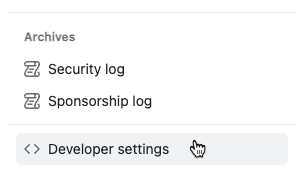
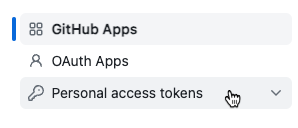
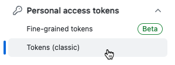
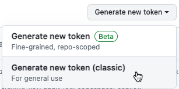
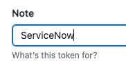
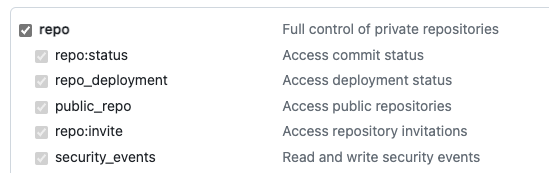
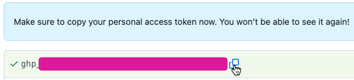

# How to set up your GitHub Credential to import a ServiceNow app from a Git Repo

## Exercise 1 - Generate the token

1. Log into GitHub.
1. In the top-right, click your avatar image. 

    

1. Click Settings.

    

1. Click Developer Settings. (*It's at the bottom of the left hand menu.*)

    

1. Click Personal access tokens >> Tokens (classic)

    

    

1. Click Generate new token >> Generate new token (classic)

    

1. Give a descriptive Note for what this token is for.

    

1. Set an Expiration that you are comfortable with. (*Or be lazy and set to No expiration* 😎 )

    

1. Check at least the repo options.

    

1. Click Generate Token at bottom of page. 

    

1. Copy the personal access token. Save it in the same secure location that you store passwords such as a post-it note or a unencrypted text file on your desktop. Be sure to name it something like "GitHub ServiceNow Token". 

    

## Exercise 2 - Put the token in ServiceNow
1. Log into your ServiceNow instance. 
1. Go to **Connections & Credentials** >> **Credentials**
1. Click **New**
1. Click **Basic Auth Credentials**
    - **Name:** A cool display name (Ex. Dale@GitHub)
    - **User name:** *The email address you use to log into GitHub with.*
    - **Password:** *The token that you generated in Exercise 1.*
1. Click **Submit**
